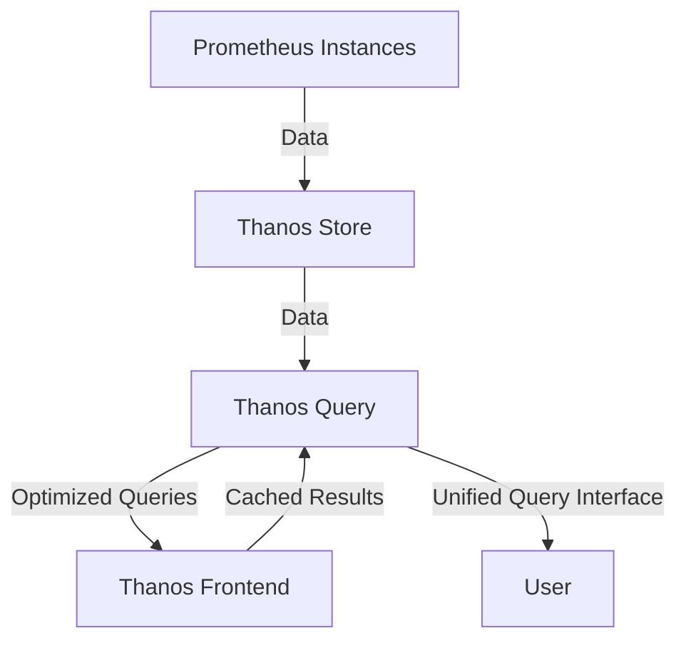

# Create Thanos Frontend
The Thanos Frontend component is responsible for query optimization and caching. It helps to reduce the load on the Thanos Query component by caching query results and optimizing query execution.

```sh
helm install thanos-frontend bitnami/thanos --namespace $NAMESPACE --set component=storegateway
```

# Create Thanos Query
The Thanos Query component aggregates data from multiple Prometheus instances and provides a unified query interface. It allows users to run PromQL queries across all the Prometheus instances in the Thanos cluster.

```sh
helm install thanos-query bitnami/thanos --namespace $NAMESPACE --set component=query
```

# Thanos Architecture


